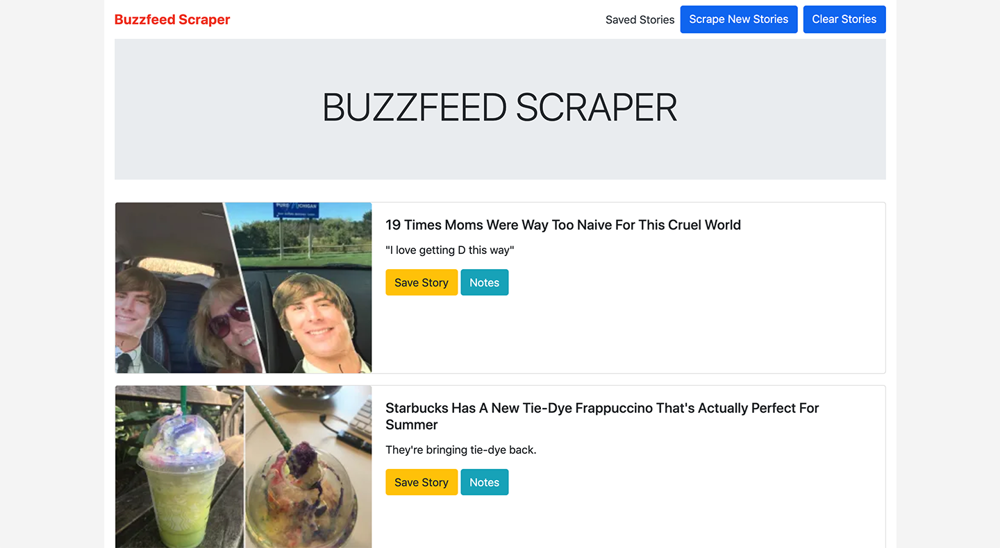

# theNews

Built with Node.js, Express, MongoDB, Mongoose, and Handlebars.

This app scrapes [buzzfeed.com](https://www.buzzfeed.com/) and pulls in the first few stories on the homepage.

Users can scrape new stories to pull in the most recent, or clear all stories.

Notes can be added to each story, and stories can be saved.

See the deployed app [here.](https://the-news1.herokuapp.com/)

